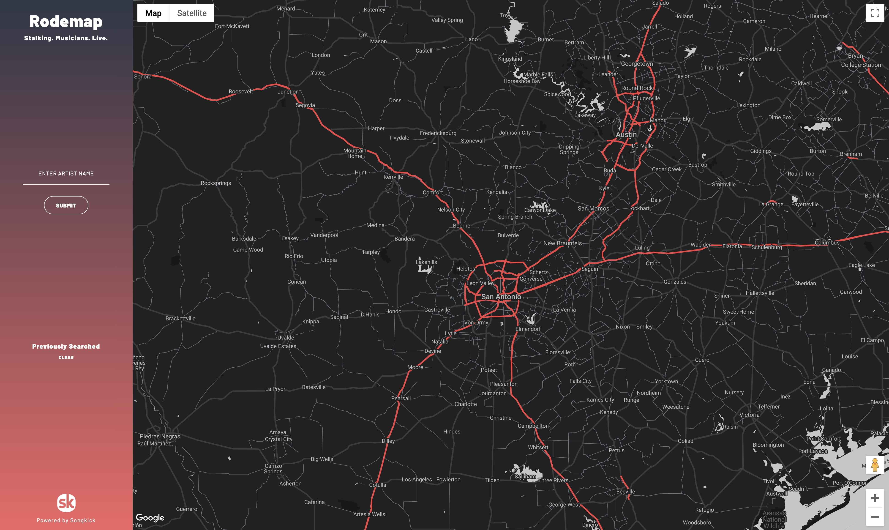
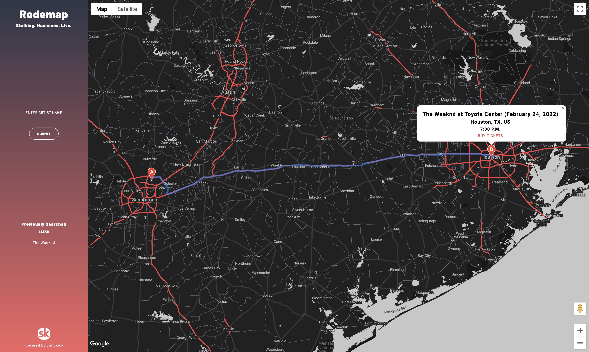
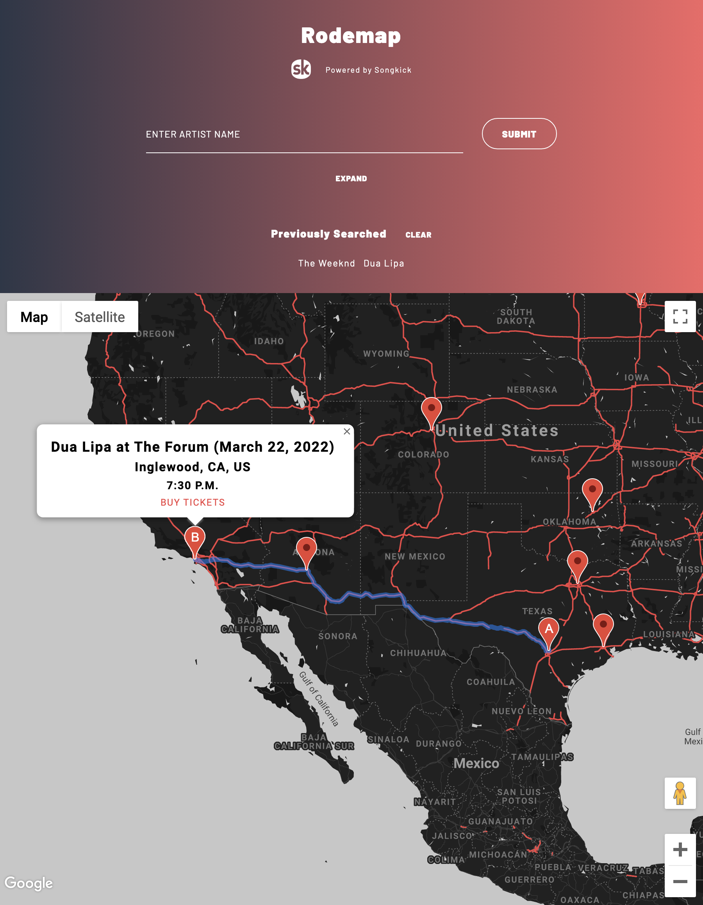

# Project 1 - Rodemap
## Description
“I’m your biggest fan, I’ll follow you until you love me...” - Lady Gaga, “Paparazzi” (2008)  

Have you ever loved an artist so much that you’d do anything to see all of their shows? Have you ever woken up with the urge to stalk someone? Have you ever been slapped with a restraining order? All of those things could happen with your new favorite concert app, Rodemap! Stalking. Musicians. Live.  

With this application, a crazed stan like you can enter an artist of your choosing, and if they’re currently on tour or planning to do so, all of their planned stops will be marked conveniently right onto the map! Click any stop to see where and when they’ll be performing and a route to get there, along with a link to buy your ticket(s). Rodemap saves your searches too, making it easy to keep track of multiple artists’ schedules at once.  

## Usage
Fans input and submit an artist's name(s), which is provided to the Songkick API. Once a corresponding artist ID is retrieved, this ID acts as a parameter for a second call that retrieves the artist's available concert dates via JSON. Other info included in this data - e.g., the latitude and longitude of various venues, start times, performance dates, listed event names - are used to create markers and fill each marker's respective info window across the map.  

Future updates for Rodemap would include exploring other APIs to fetch concert data (Ticketmaster, Spotify), updating Google Maps within our application to provide detailed directions to each event, and implementing GROUPIE MODE (combining all tour stops into one massive road trip!).  

## Credits
Rodemap was brought to you by Jager Overson (<a href="https://github.com/Baiterade">https://github.com/Baiterade</a>), Greg Zaragoza (<a href="https://github.com/ggzaragoza">https://github.com/ggzaragoza</a>), and Joseph Hill (<a href="https://github.com/joe6006">https://github.com/joe6006</a>).  

Artist data and event information are provided by Songkick (<a href="https://www.songkick.com/developer">https://www.songkick.com/developer</a>).  
Rodemap was developed using Google Maps. (<a href="https://developers.google.com/maps/documentation">https://developers.google.com/maps/documentation</a>).  
Rodemap utilizes Tailwind (<a href="https://tailwindcss.com/">https://tailwindcss.com/</a>) for certain HTML and CSS elements.

